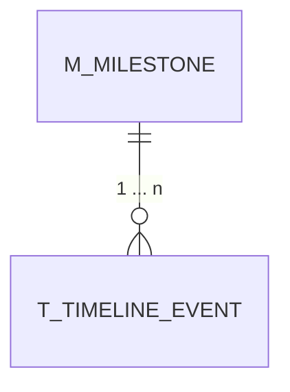

この文書は、バックエンド(当アプリ)とフロントエンド(`cd ../time-table-to-line`) **共通** のものです。

## 概要
「time-table-to-line」における「イベント」に対し、 **長めのスパンでのタスク** を意味する「マイルストーン」を設置します。
一つのマイルストーンに、いくつかのイベントが属するという意味です(属さないイベントもあります)。
### Calendar と Timeline について
Calendar (タブ左)は、ユーザー個人での操作。 Timeline (タブ右)は、グループによる(閲覧、管理者による操作する)ものと区別して考えます。

今回のマイルストーンでは、 **グループのもの** と位置づけ( **グループをまたいで共有する** 場合も考慮し)、 Timeline での操作とします。

## 機能要求
1. 概念的・機能的に、 Github Issues におけるマイルストーンとラベル(下記の色分け)に近いものを目指している
2. マイルストーンは、その **グループの管理者** のみ、作成と close を操作できる
3. ユーザーは、通常のイベントの追加とともに、属するマイルストーンを選ぶ(選ばなくても良い)
4. マイルストーンは **色分け** され、それに属するイベントは、タイムライン上にその色で表示される
5. open されているマイルストーンは 「マイルストーンタイトル: 色のバー」 というかたちで、タイムラインの上部に、一覧を確認できるようにする
6. 色は作成時、ランダムに 10 パターンほど用意し、 open されているマイルストーンとなるべく被らないようにする

### 操作の流れ
1. 管理者が、タイムライン画面の右上の「マイルストーン作成」ボタンをクリック
2. マイルストーンのタイトルと、達成の目安となる日付(任意)を入力し、決定ボタンをクリック -> タイムライン画面の左上に表示(または追加)される
3. 一覧のマイルストーンタイトルをクリック -> マイルストーンの詳細と達成の日付を入力するモーダルが現れる
4. 日付を入力し決定ボタンで、色のバーから closed と表記が変更される(何日か(実装前に検討)後に消える)

## 機能要件
### マイルストーンのテーブル定義

- 想定するカラム(型表記は SQLAlchemy 仕様)
	- id: Integer, primary_key=True
	- staff_id: Integer, ForeignKey("M_LOGININFO.STAFFID")
	- title: String(100)
	- description: String(256), nullable=True
	- color: String(10)
	- status: ~~Boolean, default=True~~ String(10), default=open // 2026-08-27 更新
	- created_at: Date()
	- guidline_end_date: Date(), nullable=True
	- accomplished_date: Date(), nullable=True
- "T_TIMELINE_EVENT" に追加するカラム
	- milestone_id: Integer, ForeignKey("MILESTONE.id"), nullable=True
	- completed: Boolean, default=False

カラムに対する機能説明:
- status: 作成されたら、 open とし、 created_at にも値が入ります。 accomplished_date に値が入れば、~~False(closed) になります。~~ waiting (waiting for close の意味)となり、数日間 **再 open** の猶予を設けます。 ~~現時点での構想 として、一度~~ 数日後(2026-08-27 更新) closed されてしまったマイルストーンは再 open できないものとします。

## 実装要件
バックエンド:
	1. DB モデルの追加
	2. DB マイグレーション(手動)
	3. API エンドポイントの追加

フロントエンド:
- タイムテーブル(Calendar):
	1. 内容・進捗入力フォームに open になっているマイルストーンを選択するセレクトボックスを追加
- タイムライン(Timeline):
	以下、 **閲覧を除く操作** に関しては **管理者権限のみ** 行うことができるようにします。
	1. マイルストーン追加のボタンとフォームを追加
	2. マイルストーンに所属するイベントの色の指定(ランダム)
	3. open になっているマイルストーン一覧の配置(グループをまたいだ共有を考え、全てのグループで同じ表示にする)
	4. 一覧のマイルストーンタイトルをクリック -> 詳細(作成した管理者名、説明(50文字程度で折りたたむ方式)、作成日、グループ名、達成日を入力するボックス)モーダルが出現 -> 達成日入力・決定で close を反映
- 共通:
	- マイルストーン関連のデータフェッチ、 エンドポイント API を叩く処理(TanStack Query)

## 実装詳細
バックエンド:
- 実装は既存の CRUD パターンを踏襲し、 `app/models.py` `app/schemas.py`  `app/routers/timetable.py` に /milestone/* を追加

フロントエンド:
- 共通:
	- `src/lib/TimelineType.ts` の、`TimelineEventProps` 型の変更(属性の追加)と、マイルストーンの型を定義します。
	- TanStack Query: "/milestone/add", "/milestone/all", "/milestone/update" , "/milestone/remove" を追加し、 "/event/add" と "/event/update" に `milestone_id`, `completed` を通せる形にします。
- タイムライン(Timeline):
	- **配色について**:
		- イベントのデフォルトの色( #2196f3)、一度クリックされた色( #ffc107)、と区別するため、その **2色と近い色は避けて** ください。

### 2026/08/20 追記
- completed: マイルストーンの close に合わせて、自動で True にします。
- 削除: UI に削除ボタンも追加します(作成ミスのときため)。
- 色: 10 件超えた場合、 1 つ目で付けた色にし、以降は **同順でサイクル** させます。たぶん 10 を超えることはないでしょう。
	**重要**: completed または、マイルストーンが削除されたタイムライン上のイベントは、デフォルトの色( #2196f3)に変更させます。
- milestone_id: 既存 /event/add スキーマに optional での追加で良いです。

### 2026/08/27 追記
- マイルストーンの **再 open の猶予期間** を持たせるため、M_MILESTONE.status を String(10) に変更します。
  - 注入される値は、 open, waiting, closed を想定しています(waiting は、 waiting for close の意味)。

## 今後の展望
- 管理者権限による、タイムラインの操作
	- イベントの伸縮・移動
		-> それに伴う、タイムテーブルへの反映
- マイルストーン一覧の "色のバー" をドラッグ・アンド・ドロップして、イベントを追加する(一般ユーザーも可能にする)
- タイムテーブルの "month" ビューでの、イベントの追加(つまりは、日またぎ)
	-> "week" ビューの `class="rbc-row"` へ追加
